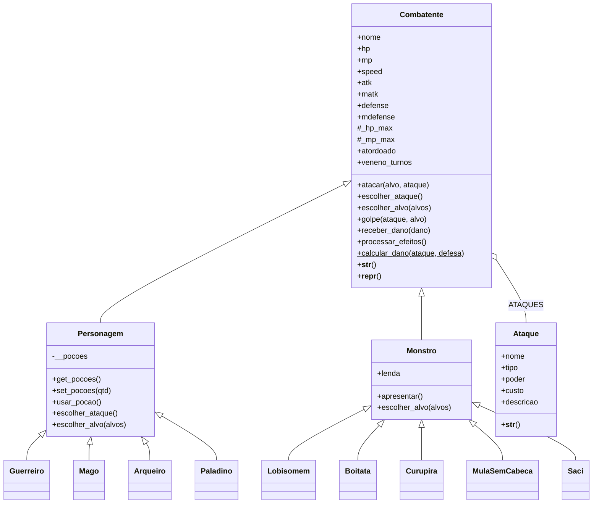

# Lendas do Brasil: RPG de Turnos com POO

**CP2 - Python | Programação Orientada a Objetos**

Criaturas do folclore brasileiro invadiram a vila! Neste mini-RPG de terminal, heróis (Guerreiro, Mago, Arqueiro e Paladino) enfrentam o Lobisomem, o Boitatá, o Curupira, a Mula sem Cabeça e o Saci em batalhas por turnos 1v1 e 3v3. Cada combatente tem um conjunto próprio de ataques, com custo de mana e efeitos como atordoamento e veneno. O projeto aplica os conceitos de POO vistos em aula: classes, objetos, atributos, métodos, herança, polimorfismo, encapsulamento, métodos especiais, método estático, composição e cópia de objetos.

## Integrantes

| Nome | RM |
|------|----|
| Luiz Henrique de Paiva Alves Pinto | RM 572177 |
| Victor Hugo Mielle Bernardes da Silva | RM 571138 |

## Como executar

Requer apenas Python 3.8+ (sem bibliotecas externas).

```bash
git clone https://github.com/<usuario>/<repositorio>.git
cd <repositorio>
python main.py
```

No menu é possível escolher:

```
1 - Batalha 1v1 (automática)
2 - Batalha 1v1 (você controla o herói)
3 - Batalha 3v3 (automática)
4 - Batalha 3v3 (você controla os heróis)
5 - Ver fichas de heróis e monstros
0 - Sair
```

Nos modos controlados, a cada turno o jogador escolhe entre **atacar** ou **usar poção**. Ao atacar, escolhe qual ataque usar (ataques sem mana suficiente ficam bloqueados) e qual monstro será o alvo. Nos modos automáticos, os heróis decidem sozinhos.

## Estrutura do projeto

| Arquivo | Conteúdo |
|---------|----------|
| `ataque.py` | Classe `Ataque`, que guarda nome, tipo, poder, custo de mana e descrição de cada habilidade |
| `combatente.py` | Classe base `Combatente` com os atributos obrigatórios, efeitos de status e a lógica comum de combate |
| `personagens.py` | Classe pai `Personagem` e os heróis `Guerreiro`, `Mago`, `Arqueiro` e `Paladino` |
| `monstros.py` | Classe pai `Monstro` e os monstros `Lobisomem`, `Boitata`, `Curupira`, `MulaSemCabeca` e `Saci` |
| `batalha.py` | Sistemas de batalha 1v1 e 3v3, escolha de ataques e alvos, condições de vitória/derrota |
| `main.py` | Instanciação dos objetos e menu principal |

## Diagrama de classes



## Atributos

| Classe | HP | MP | SPD | ATK | MATK | DEF | MDEF | Passiva |
|--------|---:|---:|----:|----:|-----:|----:|-----:|---------|
| Guerreiro | 150 | 30 | 8 | 26 | 5 | 16 | 8 | Maior HP e defesa física do time |
| Mago | 95 | 90 | 10 | 8 | 42 | 8 | 18 | Começa com 2 poções |
| Arqueiro (inédita) | 110 | 40 | 16 | 27 | 6 | 11 | 11 | 25% de chance de disparo duplo em qualquer flecha |
| Paladino (inédita) | 135 | 55 | 7 | 23 | 22 | 18 | 16 | Prefere se curar quando está abaixo de 40% do HP |
| Lobisomem | 158 | 30 | 11 | 28 | 0 | 12 | 6 | Entra em fúria abaixo de 50% do HP (+30% ATK) |
| Boitatá | 150 | 60 | 9 | 14 | 36 | 12 | 22 | Maior defesa mágica entre os monstros |
| Curupira | 125 | 30 | 18 | 28 | 22 | 12 | 12 | Pés virados: 20% de chance de esquivar de qualquer ataque |
| Mula sem Cabeça | 150 | 28 | 14 | 29 | 27 | 15 | 12 | Mistura ataques físicos e mágicos |
| Saci | 120 | 30 | 20 | 20 | 33 | 10 | 18 | Persegue quem tem mais mana e rouba MP com o Redemoinho |

## Ataques

O **poder** multiplica o ATK (ataques físicos) ou o MATK (ataques mágicos) antes de subtrair a defesa do alvo.

### Heróis

| Classe | Ataque | Tipo | Poder | Custo | Efeito |
|--------|--------|------|------:|------:|--------|
| Guerreiro | Espadada | Físico | 1.0 | 0 | Ataque básico |
| Guerreiro | Investida | Físico | 1.2 | 6 | 30% de chance de atordoar |
| Guerreiro | Golpe Brutal | Físico | 1.6 | 12 | Golpe devastador |
| Mago | Golpe de Cajado | Físico | 1.0 | 0 | Ataque fraco, para quando a mana acaba |
| Mago | Bola de Fogo | Mágico | 1.0 | 10 | Ataque mágico básico |
| Mago | Raio Congelante | Mágico | 0.8 | 14 | 40% de chance de atordoar |
| Mago | Meteoro | Mágico | 1.4 | 24 | Magia mais poderosa |
| Arqueiro | Flecha Comum | Físico | 1.0 | 0 | Ataque básico |
| Arqueiro | Flecha Perfurante | Físico | 1.0 | 8 | Ignora metade da defesa física |
| Arqueiro | Flecha Envenenada | Físico | 0.8 | 10 | Veneno: 7 de dano por 3 turnos |
| Paladino | Martelada | Físico | 1.0 | 0 | Ataque básico |
| Paladino | Golpe Sagrado | Híbrido | 1.0 | 10 | Dano físico + metade do dano mágico |
| Paladino | Julgamento Divino | Mágico | 1.3 | 16 | Luz sagrada |
| Paladino | Luz Curativa | Cura | 30% | 15 | Recupera 30% do HP máximo |

### Monstros

| Monstro | Ataque | Tipo | Poder | Custo | Efeito |
|---------|--------|------|------:|------:|--------|
| Lobisomem | Garras | Físico | 1.0 | 0 | Ataque básico |
| Lobisomem | Mordida Selvagem | Físico | 1.2 | 8 | Sangramento: 6 de dano por 3 turnos |
| Lobisomem | Salto Feroz | Físico | 1.3 | 12 | Salta sobre a presa |
| Boitatá | Bote Flamejante | Físico | 1.0 | 0 | Ataque básico |
| Boitatá | Fogo Encantado | Mágico | 1.0 | 10 | Ataque mágico de fogo |
| Boitatá | Olhar Flamejante | Mágico | 0.7 | 12 | 35% de chance de atordoar |
| Curupira | Armadilha da Mata | Físico | 1.0 | 0 | Ataque básico |
| Curupira | Assobio Estridente | Mágico | 1.0 | 8 | 25% de chance de atordoar |
| Curupira | Cipó Venenoso | Físico | 0.8 | 10 | Veneno: 6 de dano por 3 turnos |
| Mula sem Cabeça | Coice | Físico | 1.0 | 0 | Ataque básico |
| Mula sem Cabeça | Labareda | Mágico | 1.0 | 8 | Fogo que sai do pescoço |
| Mula sem Cabeça | Galope em Chamas | Físico | 1.3 | 14 | Queimadura: 5 de dano por 3 turnos |
| Saci | Redemoinho | Mágico | 1.0 | 0 | Rouba até 6 de MP do alvo |
| Saci | Rasteira | Físico | 1.0 | 6 | 30% de chance de atordoar |
| Saci | Fumaça do Cachimbo | Mágico | 1.3 | 12 | Fumaça encantada |

## Regras de combate

- **Dano físico:** `atk x poder - defense`. **Dano mágico:** `matk x poder - mdefense`. O dano mínimo é 1, calculado pelo método estático `Combatente.calcular_dano`.
- **Acerto crítico:** 10% de chance de causar 1.5x o dano.
- **Iniciativa:** no 1v1, quem tem maior `speed` ataca primeiro (empate favorece o herói). No 3v3, todos os vivos agem a cada rodada em ordem decrescente de `speed`.
- **Escolha de ataques:** no modo automático, os heróis usam o ataque mais poderoso que a mana permite (o Paladino se cura quando está ferido); os monstros sorteiam entre os ataques disponíveis.
- **Seleção de alvos:** os heróis focam no inimigo mais ferido; os monstros têm "instinto de caçador" (60% de chance de atacar o herói mais ferido, senão atacam um aleatório); o Saci sempre persegue quem tem mais mana. No modo controlado, o jogador escolhe o alvo.
- **Efeitos de status:** o alvo **atordoado** perde a próxima vez de agir. O **veneno** (também usado para sangramento e queimadura) causa dano no início de cada turno do alvo, por 3 turnos. Efeitos só são aplicados se o ataque causar dano (uma esquiva do Curupira anula o efeito).
- **Poções:** recuperam 35% do HP máximo. No modo automático, o herói bebe quando está abaixo de 30% do HP.
- **Vitória/derrota:** um time perde quando todos os membros ficam com `hp <= 0`. Após 50 rodadas a batalha termina em empate.
- **Destaque:** ao final, o herói que causou mais dano é anunciado.

## Requisitos do CP2 e onde estão no código

| Requisito | Onde |
|-----------|------|
| Atributos obrigatórios (hp, mp, speed, atk, matk, defense, mdefense) | `Combatente.__init__`, herdado por heróis e monstros |
| Classes pai `Personagem` e `Monstro` | `personagens.py` e `monstros.py` |
| `Guerreiro` e `Mago` herdando de `Personagem` | `personagens.py` |
| Classe jogável inédita | `Arqueiro` e `Paladino` em `personagens.py` |
| Instanciação de objetos | `criar_herois()` e `criar_monstros()` em `main.py`; objetos `Ataque` em cada classe |
| Batalha 1v1 por turnos com speed | `batalha_1v1()` em `batalha.py` |
| Batalha 3v3 com seleção de alvos e vitória/derrota | `batalha_3v3()`, `escolher_alvo()` e `time_derrotado()` |
| Herança | `super().__init__()` em todas as subclasses |
| Polimorfismo | `atacar()` sobrescrito em cada herói e monstro; `escolher_ataque()`, `escolher_alvo()` e `receber_dano()` sobrescritos em algumas classes; `executar_turno()` chama esses métodos sem saber a classe do objeto |
| Criatividade | Tema de folclore brasileiro, 29 ataques diferentes, efeitos de atordoamento e veneno, passivas únicas por classe, críticos, poções, modo manual e destaque da batalha |

### Outros conceitos de POO aplicados

- **Encapsulamento:** `__pocoes` é privado (name mangling), acessado só por `get_pocoes()`, `set_pocoes()` e `usar_pocao()`; `_hp_max` e `_mp_max` são protegidos, com getters.
- **Composição:** cada classe possui uma lista de objetos `Ataque` (atributo de classe `ATAQUES`).
- **Métodos especiais:** `__init__`, `__str__` (linha de status com barra de vida e efeitos ativos) e `__repr__` (representação para depuração), tanto em `Combatente` quanto em `Ataque`.
- **Método estático:** `Combatente.calcular_dano()` com `@staticmethod`.
- **Cópia de objetos:** cada batalha usa `deepcopy()` dos objetos do catálogo, então os originais continuam com HP e MP cheios para a próxima luta.
- **Inspeção de objetos:** `isinstance()` diferencia heróis de monstros no sistema de turnos.

## Exemplo de saída

```
── Rodada 1 ────────────────────────────────────────
   Ordem: Saci → Curupira → Lobisomem → Celeste → Bento Machado → Frei Anselmo

   Saci usa Redemoinho em Celeste!
   → Celeste sofre 15 de dano (80/95 HP)
   Saci rouba 6 de MP de Celeste e esconde no gorro vermelho!
   Curupira usa Cipó Venenoso em Celeste!
   → Celeste sofre 14 de dano (66/95 HP)
   Celeste foi envenenado! (6 de dano por 3 turnos)

   ▶ Vez de Celeste (Mago) - HP 60/95 | MP 84/90
     1 - Atacar
     2 - Usar poção (2 restante(s))
     Escolha: 1
     Escolha o ataque:
       1 - Golpe de Cajado (sem custo) - Ataque físico fraco, para quando a mana acaba
       2 - Bola de Fogo (10 MP) - Ataque mágico básico
       3 - Raio Congelante (14 MP) - Congela o alvo; 40% de chance de atordoar
       4 - Meteoro (24 MP) - Magia mais poderosa, com 1.4x o MATK
     Ataque: 4
     Escolha o alvo:
       1 - Lobisomem (158/158 HP)
       2 - Saci (120/120 HP)
       3 - Curupira (125/125 HP)
     Alvo: 1
   Celeste usa Meteoro em Lobisomem!
   → Lobisomem sofre 52 de dano (106/158 HP)
```

## Referências

- DEITEL, P.; DEITEL, H. *Intro to Python for Computer Science and Data Science*. Pearson, 2022.
- DOWNEY, A. B. *Think Python: how to think like a Computer Scientist*. 3. ed. O'Reilly Media, 2023.
